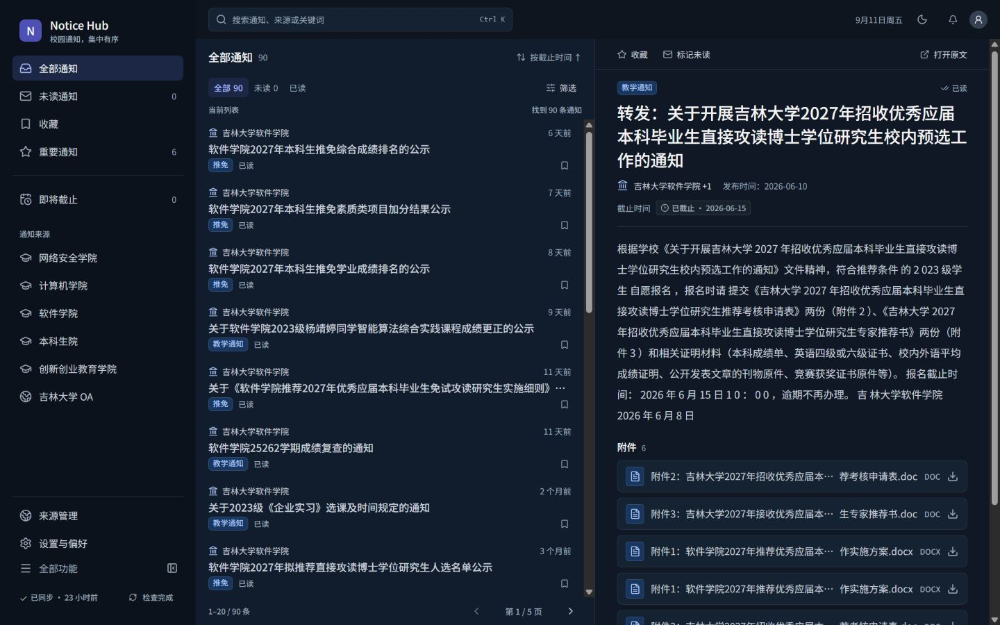

# JLU Notice Monitor

English | [中文](README_zh-CN.md)

> A Windows desktop app that aggregates, deduplicates, filters, and delivers notices from official campus sources.

Current release: **v0.7.0-rc1**

JLU Notice Monitor helps students follow important announcements without repeatedly checking separate university and department websites. It currently ships with Jilin University sources, while its source-adapter model is designed to support other public organizations and campuses.



## Features

- Aggregates notices from multiple official sources.
- Performs incremental crawling, content-hash deduplication, and update detection.
- Extracts notice content, attachments, categories, importance, and deadlines.
- Supports search, source/category filters, read state, favorites, and responsive layouts.
- Uses cloud-preferred execution for official public sources with safe local fallback when the cloud feed is unavailable or stale.
- Sends Windows native notifications according to local importance, deadline, quiet-hours, and source-health preferences.
- Stores the local database and preferences in the user's application-data directory; upgrades do not replace that data.

## Supported sources

The bundled v0.7.0-rc1 adapters cover:

- Jilin University OA public campus notices
- School of Cyber Science and Engineering
- College of Computer Science and Technology
- College of Software
- Undergraduate School
- College of Innovation and Entrepreneurship

Additional public or local sources can be added through the source-management architecture. A source shown above can still be temporarily unavailable when its upstream website is offline or changes its markup.

## Architecture

```text
Official source / cloud feed
            |
     Source adapters
            |
 FastAPI processing pipeline
  crawl -> parse -> deduplicate
       -> classify -> notify
            |
        SQLite data
            |
 React + TypeScript interface
            |
   Tauri 2 Windows desktop app
```

The production installer bundles the Tauri application and a managed FastAPI backend sidecar. The sidecar binds only to a dynamically allocated loopback port. Source code, Python environments, Node modules, development tools, databases, and logs are not part of the installer.

## Install on Windows

1. Open the GitHub Release for `v0.7.0-rc1`.
2. Download `JLU Notice Monitor_0.7.0-rc1_x64-setup.exe` and its SHA256 checksum.
3. Verify the checksum in PowerShell:

   ```powershell
   Get-FileHash -Algorithm SHA256 '.\JLU Notice Monitor_0.7.0-rc1_x64-setup.exe'
   ```

4. Run the installer and launch **JLU Notice Monitor** from the Start menu or shortcut.

Windows 10/11 x64 and Microsoft Edge WebView2 Runtime are required. Supported Windows versions normally include WebView2; if it is missing, install the current runtime from Microsoft before launching the app.

This is a release candidate. Keep backups of important data and report problems through the repository's GitHub Issues page.

## Development

Prerequisites:

- Python 3.12 or newer (the project CI and release environment use Python 3.13)
- Node.js 24 and npm
- Rust toolchain compatible with Rust 1.77.2 or newer
- Windows and NSIS prerequisites for packaging the desktop installer

Set up the backend:

```powershell
Set-Location backend
python -m venv .venv
.\.venv\Scripts\python.exe -m pip install -e '.[dev,desktop]'
.\.venv\Scripts\python.exe -m pytest
```

Set up and validate the frontend:

```powershell
Set-Location frontend
npm ci
npm test -- --run
npm run lint
npm run build
npm run e2e
```

Build the production Windows installer:

```powershell
Set-Location frontend
npm run desktop:build
```

The build script first produces the PyInstaller backend sidecar, then builds the frontend and Tauri NSIS package. Local configuration belongs in the provided `.env.example` files; never commit credentials or runtime data.

## Repository layout

- `backend/` — FastAPI application, crawler, SQLite models, and pytest suite
- `frontend/` — React/Vite interface, Vitest and Playwright tests, and the Tauri shell
- `docs/` — design contract, implementation reports, and validation evidence

## License

No project-wide open-source license has been declared yet. Source availability does not grant permission to redistribute or create derivative works. Third-party assets retain the licenses documented alongside them.
